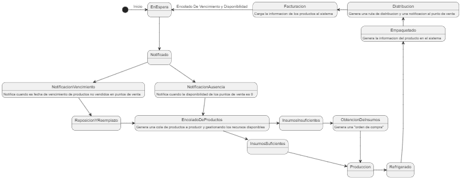

Gya dulzuras es el emprendimiento de la tia, que al estar cerca, podemos analizar y diagnosticar para conseguir optimizar algunos procesos. Ademas se le puede intentar construir herramientas y automatizaciones de sus tareas y procesos teniendo como usuario final alguien a quien capacitar

### Proceso:

### Objetivo: 
Crear un sistema que *simplifique* y* automatice* tareas del ciclo, con el fin de **alivianar el esfuerzo del personal interviniente** por medio de *notificaciones* y un *panel general de control* para control de stock, de ventas, y de tareas pendientes que *facilite la toma de decisiones*. 
Aunque el sistema pueda o no ser utilizado por el usuario objetivo, la **finalidad es el aprendizaje**.
